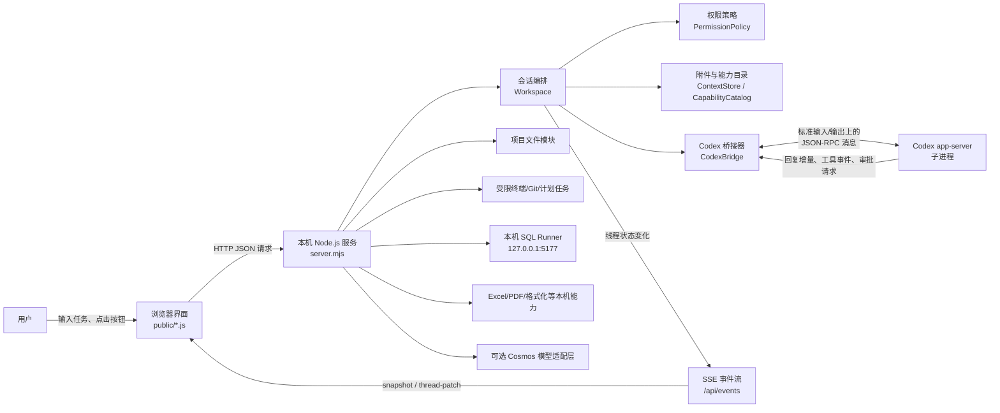
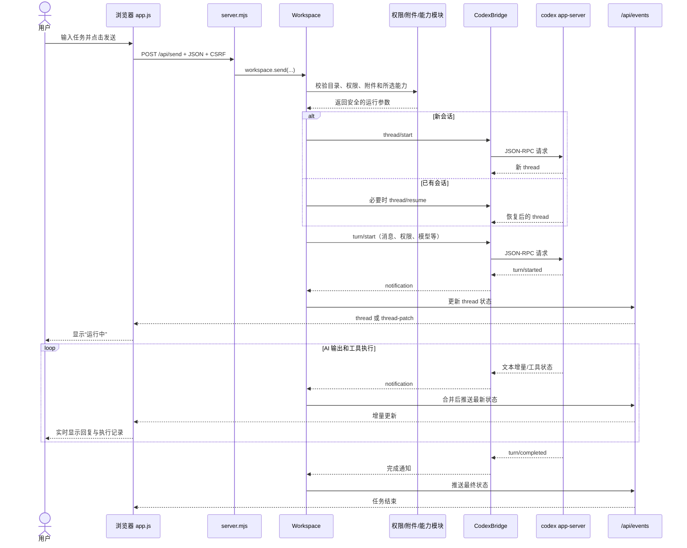
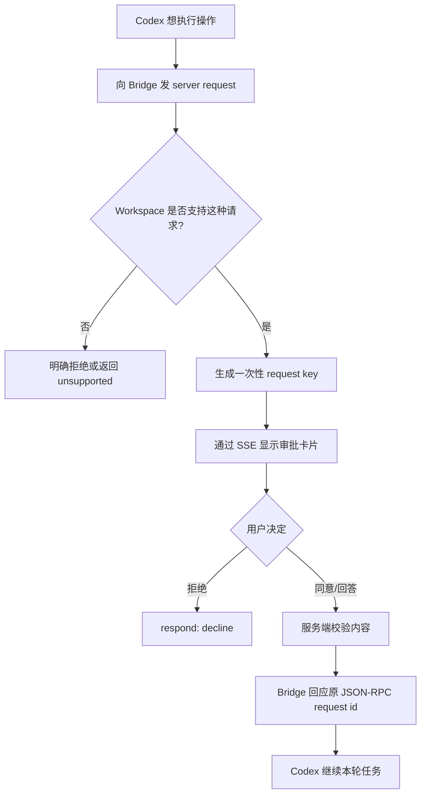
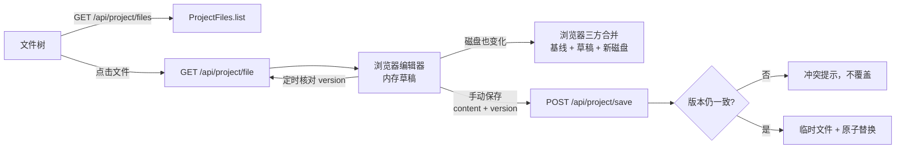
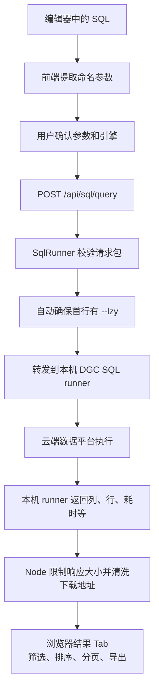
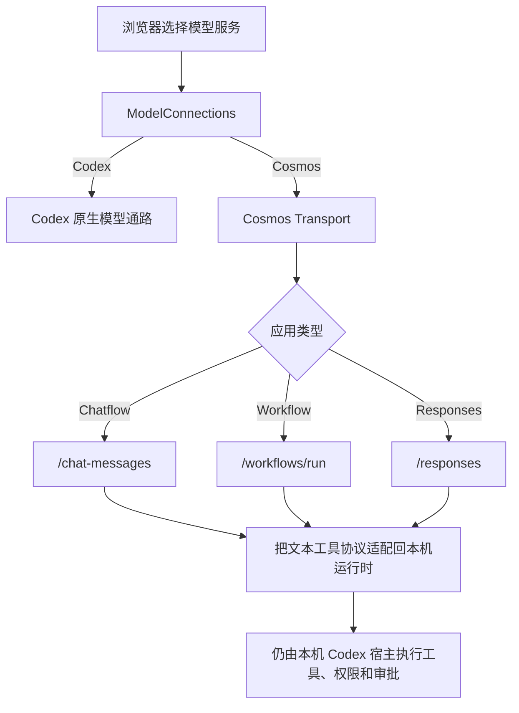
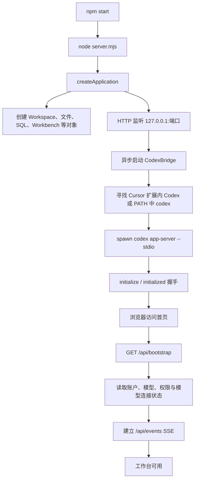

# 柠檬工作台（codex-web-shell）原理详解

> 面向第一次接触这个项目的读者。本文基于当前目录中的实际代码编写，重点解释“它为什么能工作”和“一条请求如何从网页走到 Codex，再回到网页”。

## 1. 先用一句话说明它是什么

这个项目是一个运行在本机的 **Codex Web 工作台**：它用普通浏览器提供聊天、文件编辑、终端、SQL 查询、Git、Excel/PDF 预览等界面，再由本机 Node.js 服务把这些操作安全地转交给 Codex 运行时或其他本机服务。

它不是把某个现成的 Codex 网页“套壳”，也不是在浏览器里直接运行 Codex。它更像一个翻译员和门卫：

- 浏览器负责“看见什么、点什么、输入什么”；
- Node.js 服务负责“检查请求、访问本机资源、维护状态”；
- Codex `app-server` 负责“理解任务、调用工具、产出回复”；
- SSE 长连接负责“把执行进度实时推回网页”。

## 2. 用一个生活比喻理解

可以把整个系统想成一家餐厅：

| 项目部分 | 餐厅比喻 | 实际职责 |
|---|---|---|
| 浏览器页面 `public/` | 顾客和点餐屏 | 展示聊天、编辑器、按钮、结果；收集用户操作 |
| `server.mjs` | 前台经理 | 接收 HTTP 请求、校验身份和来源、把请求分派给正确模块 |
| `lib/workspace.mjs` | 服务员/订单管理员 | 管理会话、任务、审批、附件、模型和执行状态 |
| `lib/bridge.mjs` | 后厨传菜口 | 启动 Codex 子进程，通过 JSON-RPC 双向传递命令和事件 |
| Codex `app-server` | 厨房 | 理解自然语言、推理、调用工具、修改文件并生成答案 |
| `/api/events` SSE | 叫号屏 | 持续把回复增量、工具进度、审批请求推给浏览器 |
| 文件/终端/SQL 等模块 | 专门操作间 | 在严格边界内完成文件、命令、查询、预览等工作 |

最重要的一点是：**浏览器不直接碰 Codex 凭据，也不直接随意读取本机文件。** 所有敏感能力都要经过本机服务检查。

## 3. 总体架构图



这里有两类通路：

1. **请求通路**：浏览器通过 HTTP 主动发起操作，例如发送消息、保存文件、执行 SQL。
2. **事件通路**：服务端通过 SSE 主动通知浏览器，例如 AI 又输出了一段文字、命令执行完成、需要用户审批。

## 4. 项目为什么分成三层

### 4.1 浏览器层：只负责交互与展示

主要代码在 `public/`：

- `index.html`：页面骨架；
- `app.js`：前端总控制器，负责启动、会话、发送消息和实时同步；
- `file-editor.js`、`file-tree.js`：文件编辑与目录树；
- `workbench.js`：终端、搜索、变更、连接、计划任务等工作台；
- `sql-query.js`、`sql-parameters.js`：SQL 参数、结果表格、筛选和导出；
- `interactions.js`、`editor-window.js`：主题、布局、草稿、弹层等交互；
- `permissions.js`：展示并回应审批；
- `markdown.js`、`code-highlight.js`：回复渲染和代码高亮。

这个前端没有使用 React、Vue 等框架，而是使用浏览器原生 ES Module、DOM 和 `fetch`。优点是构建链路简单，静态文件可由 Node 服务直接返回；代价是 `app.js` 会承担较多协调职责。

### 4.2 本机服务层：系统的控制中心

`server.mjs` 使用 Node 原生 `http` 模块启动服务，只监听 `127.0.0.1`。它主要完成四件事：

1. 返回 `public/` 中的静态页面；
2. 提供 `/api/...` 接口；
3. 初始化并组合 `lib/` 下的业务模块；
4. 把会话变化通过 SSE 广播给浏览器。

它没有把全部逻辑堆在路由里，而是把具体能力拆给不同类。例如：

- `Workspace` 管会话；
- `ProjectFiles` 管文件；
- `Workbench` 管终端、Git 和计划任务；
- `SqlRunner` 对接本机 SQL 执行服务；
- `ModelConnections` 管 Codex/Cosmos 模型连接；
- `FileHistory` 管网页保存历史和恢复。

### 4.3 Codex 运行时层：真正的 AI 和工具执行核心

`lib/bridge.mjs` 会启动：

```text
codex app-server --stdio
```

这是一个独立子进程。Node 服务和它通过标准输入、标准输出逐行交换 JSON 消息，也就是 JSON-RPC 风格的通信：

- Node 发请求：`thread/start`、`turn/start`、`thread/read` 等；
- Codex 返回结果；
- Codex 也会主动通知：回复增量、任务完成、工具执行进度；
- Codex 还能反向请求网页审批或向用户提问。

因此，网页只是一个 Codex 客户端；真正的登录状态和运行时凭据留在 Codex 子进程中。`bridge.mjs` 甚至主动丢弃子进程的 `stderr`，避免插件或模型服务可能输出的敏感信息进入日志。

## 5. 一条聊天消息是怎样跑完的

下面是项目最核心的一条链路。



### 5.1 浏览器发送什么

前端提交 `/api/send` 时，会带上：

- 用户文字；
- 当前工作目录；
- 当前或新会话 ID；
- 模型与推理强度；
- 权限模式；
- 附件编号；
- 用户选择的 Skill、插件或能力；
- 可选目标信息。

浏览器不会把任意服务器内部对象传进去。服务端会再次验证每个字段，不能依赖前端按钮“看起来是禁用的”来保证安全。

### 5.2 服务端发送前做什么

`Workspace.send()` 大致按以下顺序处理：

1. 校验消息长度和参数格式；
2. 锁住当前会话，防止重复提交；
3. 确认模型服务和已有会话是否匹配；
4. 把工作目录解析为真实存在的绝对目录；
5. 根据权限模式生成 sandbox 和审批策略；
6. 把附件 ID 解析成服务端登记过的附件；
7. 从运行时读取所选能力的真实定义；
8. 新建或恢复 Codex thread；
9. 先在内存中放一条 `pending` 用户消息，让界面立即有反馈；
10. 调用 `turn/start` 正式开始执行。

### 5.3 为什么消息能“一个字一个字”出现

Codex 运行时会不断发出 `item/agentMessage/delta`。`Workspace.notification()` 找到对应的消息项，把 `delta` 追加到文本中，然后调用 `changed(thread)`。

`changed()` 不会每来一个字符就立刻推送，而是用约 45ms 的短暂合并窗口减少刷新次数。随后 `event-stream.mjs` 会：

- 第一次发送完整 thread；
- 后续尽量只发送变化项 `thread-patch`；
- 网络写入变慢时，同一个 thread 只保留最新待发送版本；
- 每 15 秒发送心跳，判断连接是否还活着。

所以用户看到的是流式回复，但系统不会为每个字符传一份完整历史。

## 6. 双向通信：为什么 AI 可以停下来问你

通信不是单向的。Codex 在准备执行敏感操作时，可以向 Node 服务发送反向请求，例如：

- 命令执行审批；
- 文件修改审批；
- 临时权限审批；
- 向用户提问；
- MCP 表单或 URL 确认。

流程如下：



这里没有“网页默认同意”的逻辑。不支持的交互会明确失败，敏感操作不会因为界面没处理好而悄悄放行。

## 7. 会话和状态到底保存在哪里

新手很容易把三种状态混在一起：

| 状态 | 主要位置 | 例子 |
|---|---|---|
| 原生会话历史 | Codex 运行时 | 用户消息、AI 回复、工具记录、thread 名称 |
| 当前服务进程状态 | Node 内存 | 已加载 thread、正在等待的审批、SSE 客户端、任务队列 |
| 页面偏好与可选草稿 | 浏览器 `localStorage` | 主题、布局、项目列表、置顶、打开的文件、用户明确开启的草稿缓存 |

关键结论：

- 浏览器刷新后，原生会话仍能从 Codex 读取；
- Node 重启后，内存里的“正在运行”判断不能直接当真，页面会重新同步；
- 未发送草稿默认只存在当前页面，只有用户明确开启后才明文写入浏览器本地存储；
- 浏览器不保存 Codex 登录 Token；
- Cosmos Key 只保存在服务端忽略目录，且不回显到浏览器。

## 8. SSE 实时同步为什么不用 WebSocket

这个项目大多数实时数据都是“服务端不断通知浏览器”，浏览器很少需要在同一条长连接上反向发消息。因此使用 SSE 足够：

- 服务端到浏览器：SSE `/api/events`；
- 浏览器到服务端：普通 `fetch` POST。

这种组合比 WebSocket 更简单，浏览器自带 `EventSource` 自动连接能力，也便于沿用 HTTP 的 Cookie、来源控制和代理配置。

断线恢复时，页面先重新获取 session/bootstrap，再重新建立 SSE。它只同步状态，**不会自动重放**消息、审批、SQL 或终端命令，避免断线导致重复执行。

## 9. 本机安全边界是怎样建立的

这个工作台可以访问文件和执行工具，因此安全不是附加功能，而是主架构的一部分。

### 9.1 网络边界

- Node 服务绑定 `127.0.0.1`，不直接监听局域网；
- 校验 `Host`，仅允许当前本机地址；
- 校验 `Origin` 和 `Sec-Fetch-Site`，阻止其他网站跨站调用；
- 设置 CSP、`X-Frame-Options: DENY`、`nosniff` 等响应头；
- `ningmeng.com` 也只是当前 Mac 上回环到本机的 HTTPS 入口。

### 9.2 会话和 CSRF

打开首页时，服务端生成并设置一个 `HttpOnly + SameSite=Strict` Cookie。浏览器脚本读不到这个 Cookie，但请求会自动携带它。

`bootstrap` 还会返回 CSRF 值。所有 POST 请求必须同时满足：

1. Cookie 中的随机 session 正确；
2. `Origin` 正确；
3. `X-Codex-CSRF` 正确。

即使恶意网页诱导用户点击，也很难构造一个通过这三层检查的写操作。

### 9.3 文件边界

`ProjectFiles.resolve()` 是文件访问的统一门卫。它要求：

- 工作目录必须是真实存在的绝对目录；
- 项目内路径必须是相对路径；
- 禁止 `..`、反斜杠和空字节；
- 禁止隐藏目录、依赖目录、缓存目录等排除项；
- 不跟随符号链接；
- `realpath` 后仍必须位于项目根目录内；
- 只处理普通文件和目录。

因此，前端传入 `../../其他目录/密码.txt` 也无法越过项目边界。

### 9.4 保存文件为什么不容易误覆盖

读取文件时，后端会基于文件信息和内容生成 SHA-256 版本号。保存时浏览器必须带回这个版本号，后端会：

1. 确认版本仍与磁盘一致；
2. 把新内容写入同目录的临时文件；
3. 再检查一次磁盘版本；
4. 最后用原子 `rename` 替换原文件。

如果用户在网页编辑期间，文件又被 IDE 或其他程序修改，保存会返回冲突，而不是静默覆盖别人的修改。

## 10. 文件编辑器的工作原理

文件编辑不是“打开一个远程 IDE”，而是一组明确接口：



编辑器里的未保存内容主要在浏览器内存。它支持：

- 多文件标签；
- 语法高亮；
- 查找与格式化；
- SQL AI 续写；
- 外部修改检测；
- 保守三方合并；
- 可选的本机草稿恢复。

这些功能与 Codex 会话是松耦合的：即使模型暂时离线，文件浏览和手工编辑仍然可用。

## 11. SQL 查询为什么是单独一条链路

SQL 不由网页直接连数据仓库，也不是让 Node 服务自己实现数据库驱动。`SqlRunner` 只允许连接本机 HTTP 地址，默认是：

```text
http://127.0.0.1:5177
```

执行流程：



Node 层只检查请求格式、参数和大小，不重新发明一套 SQL 语句白名单；真正的 SQL 类型、语法和操作策略由原来的 SQL runner 负责。所有经接口执行的 SQL 会带 `--lzy` 标记，便于审计。

## 12. 终端、Git 和计划任务

这些能力集中在 `lib/workbench.mjs`。

### 12.1 终端

前端看起来像终端，但后端明确说明它是“受限执行器”，不是完整 PTY。执行前仍检查：

- 工作目录；
- 用户是否明确确认；
- 是否允许写操作；
- 命令和输出大小；
- 运行时间与进程状态。

运行中的进程以 ID 管理，后续的输入、中断和查询状态都针对这个 ID，避免不同项目的输出串在一起。

### 12.2 Git

Git 功能只通过参数数组调用 Git，不拼接 shell 命令。提交与推送还有版本快照、选中文件、分支/upstream 等检查，避免页面显示的旧状态直接提交到新的仓库状态。

### 12.3 计划任务

计划任务保存于本机状态目录，由 `Workbench` 的定时器检查是否到期。它本质上是定时把任务送回已有工作流，不是云端调度平台。

## 13. Codex 与 Cosmos 两种模型通路

默认通路使用本机 Codex `app-server`。项目还提供 Cosmos 连接，但 Cosmos 并没有绕开本机运行时直接操作电脑。



Cosmos 通路的重要设计是“按需加载”：

1. 普通聊天先只发送真实对话和精简身份；
2. 模型需要项目规则、Skill 或环境时，返回 `load_context: "workspace"`；
3. 工具很多时先只给工具目录；
4. 模型通过 `load_tools` 指定要查看的完整工具定义；
5. 真正工具调用仍回到本机运行时执行，并沿用本机权限和审批。

这样既减少无关上下文，又不让远端模型直接取得本机执行权。模型服务和工具宿主是两层：Cosmos 可以负责“想”，Codex 本机运行时仍负责“做”。

## 14. 附件是怎样处理的

附件分为两类：

- 上传副本：浏览器把内容上传到当前服务进程管理的临时上下文；
- 项目引用：只登记经过边界检查的本机文件或目录。

浏览器后续发送的只是附件 ID。`ContextStore` 再把 ID 解析成内部记录，避免客户端直接伪造一个任意路径让 Codex读取。

图片预览使用不透明 UUID 路由 `/api/attachments/images/:id`，不会提供“传一个文件路径就能读取”的万能接口。项目外图片也不会因为聊天渲染而开放任意路径读取。

## 15. Excel、PDF、格式化和 AI 续写

这些属于辅助能力，不需要占用主聊天线程：

- Excel：服务端 Worker 读取工作簿并返回有限预览，不执行宏；
- PDF/HTML：在受限预览容器中显示，HTML 预览有单独的 sandbox CSP；
- SQL/Python 格式化：本机 Worker 中运行固定依赖；
- AI 续写：独立、只读、禁用工具的短生命周期 Codex 请求，结果只显示灰字，用户按 Tab 才进入草稿。

把这些任务与主对话隔离，能避免格式化或续写污染聊天历史，也避免辅助请求获得不必要的工具权限。

## 16. 代码目录地图

```text
codex-web-shell/
├── server.mjs                 # HTTP 服务、路由、安全头、模块装配
├── lib/
│   ├── bridge.mjs             # 启动 Codex app-server，收发 JSON-RPC
│   ├── workspace.mjs          # 会话、轮次、审批、队列、模型与状态核心
│   ├── event-stream.mjs       # SSE 全量快照和增量补丁
│   ├── context.mjs            # 附件与运行时能力目录
│   ├── permissions.mjs        # 权限预设和组织策略校验
│   ├── project-files.mjs      # 安全的目录浏览、读取和保存
│   ├── file-tools.mjs         # 搜索、创建、移动、替换等文件操作
│   ├── file-history.mjs       # 文件历史与恢复
│   ├── workbench.mjs          # 终端、Git、连接、计划任务、制品预览
│   ├── sql-runner.mjs         # 本机 SQL runner 代理
│   ├── model-connections.mjs  # Codex/Cosmos 配置和凭据管理
│   ├── cosmos-transport.mjs   # Cosmos 协议、SSE 和工具适配
│   └── ...                    # 标题、图片、Excel、子任务等模块
├── public/
│   ├── index.html             # 页面结构
│   ├── app.js                 # 前端总控制器
│   ├── file-editor.js         # 文件编辑器
│   ├── workbench.js           # 工作台界面
│   ├── sql-query.js           # SQL 查询结果交互
│   └── ...                    # 其他独立 UI 模块
├── test/                      # Node 测试和 DOM/行为回归
├── scripts/                   # 冒烟检查、域名配置、运行时检查
├── package.json               # 启动命令和固定依赖
└── AGENTS.md                  # 当前项目的维护约定
```

## 17. 启动过程



`CodexBridge` 会优先寻找 Cursor 官方 Codex 扩展自带的可执行文件，找不到才使用 PATH 中的 `codex`，也可以用 `CODEX_BIN` 指定。

## 18. 一个具体例子：让 AI 修改文件

假设用户输入：“把 README 的启动说明写清楚。”

1. 前端把文字、项目目录、模型和权限发到 `/api/send`。
2. `Workspace` 验证目录和权限，调用 `turn/start`。
3. Codex 判断需要读取 `README.md`，调用本机文件工具。
4. 如果操作需要审批，页面收到审批卡片；用户允许后 Codex 继续。
5. Codex 生成补丁并执行文件修改。
6. 运行时发出 `fileChange` 和回复增量事件。
7. `Workspace` 只保留适合展示的字段，不把原始推理内容发到网页。
8. SSE 把变更推给浏览器，页面显示文件修改记录。
9. 本轮结束后，前端刷新对应文件；如果编辑器有未保存草稿，则走冲突/合并逻辑，而不是直接覆盖。

这说明 AI 修改文件和用户在编辑器保存文件是两条不同路径，但最终都要尊重文件版本和用户草稿。

## 19. 这个设计的优点与代价

### 优点

- **本机优先**：登录、文件和工具尽量留在本机；
- **职责清楚**：界面、HTTP、安全、会话、模型运行时分层；
- **实时反馈**：SSE 支持回复、工具和审批状态流式展示；
- **故障保守**：断线不自动重放有副作用的操作；
- **安全边界明确**：回环监听、Cookie、CSRF、路径校验、版本冲突、权限审批层层检查；
- **可扩展**：文件、SQL、Git、模型服务都通过独立模块接入。

### 代价

- 前端使用原生 DOM，总代码协调复杂度集中在 `app.js`；
- Node 服务维护大量内存状态，重启后必须与原生运行时重新同步；
- SSE 适合服务端推送，但复杂的双向实时终端仍需额外 HTTP 操作配合；
- Cosmos 适配要在文本协议、上下文体积和工具安全之间做更多校验；
- 功能很多，回归测试必须覆盖聊天、文件、权限、SQL 和布局之间的组合关系。

## 20. 阅读源码的推荐顺序

如果准备继续维护，建议按以下顺序阅读：

1. `README.md`：先知道产品提供什么；
2. `server.mjs`：看模块如何组装、有哪些接口；
3. `lib/bridge.mjs`：理解 Node 如何连接 Codex；
4. `lib/workspace.mjs`：理解会话、消息、审批和事件；
5. `lib/event-stream.mjs`：理解实时更新；
6. `public/app.js`：把后端状态与页面操作对起来；
7. `lib/project-files.mjs`：理解文件安全边界；
8. 再按需求阅读 SQL、终端、Cosmos、编辑器等具体模块；
9. 最后看 `test/`，测试往往比注释更清楚地说明边界条件。

## 21. 最后再压缩成一句人话

**柠檬工作台就是一个只在本机开放的网页控制台：网页负责交互，Node 服务负责安全和编排，Codex 子进程负责 AI 与工具执行，SSE 负责把执行过程实时送回网页；文件、SQL、终端和其他能力都必须经过各自的受限接口。**
